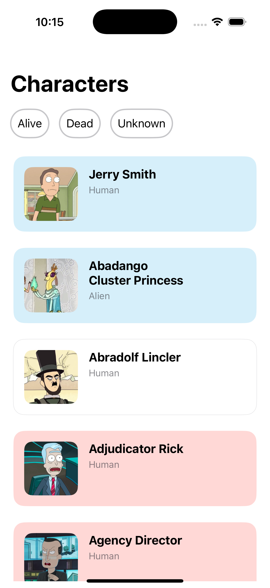
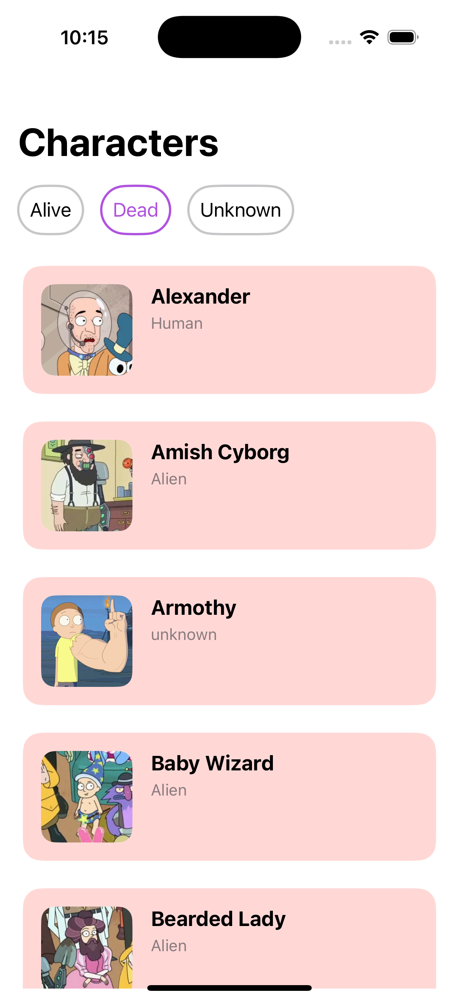
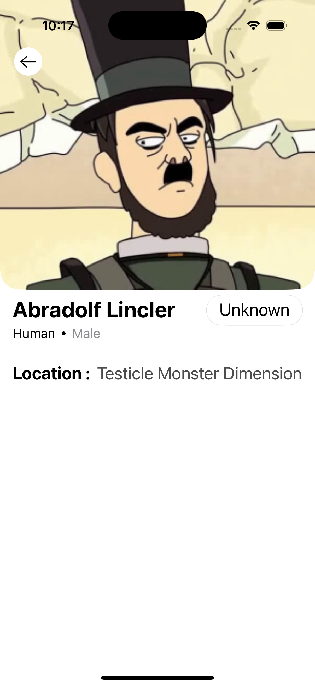
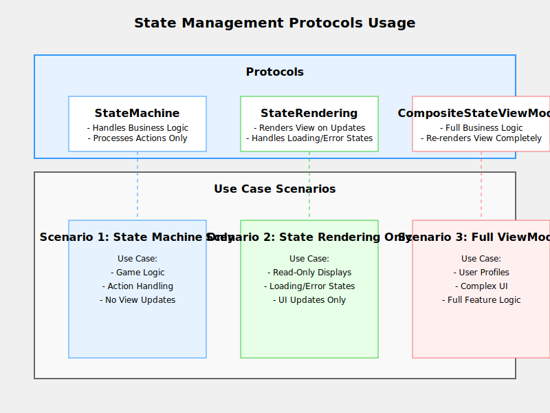

# Characters App 📱

**Characters App** is a Swift-based iOS application built using MVVM architecture. The app displays a list of characters with their details and allows filtering characters by their status: **Alive**, **Dead**, or **Unknown**. The app also includes a detailed view for individual characters.

---

## **Table of Contents**

1. [Introduction](#introduction)
2. [Features](#features)
3. [App Screenshots](#app-screenshots)
4. [How It Works](#how-it-works)  
   - [Main View](#1-main-view)  
   - [Filter Characters](#2-filter-characters)  
   - [Character Details](#3-character-details)
5. [Setup & Installation](#setup--installation)
6. [Architecture Overview](#architecture-overview)  
   - [Data Layer](#data-layer)  
   - [Domain Layer](#domain-layer)  
   - [Presentation Layer](#presentation-layer)
7. [Graphs](#dependency-injection-graph)
8. [Key Improvements](#key-improvements)
9. [Dependencies](#dependencies)
10. [API Integration](#api-integration)  
    - [Endpoints](#endpoints)
11. [Future Enhancements](#future-enhancements)
12. [Contributing](#contributing)
13. [License](#license)

---

## **Features**
- 📜 **List of Characters**: Displays a table view of all characters with their name, species, and status.
- 🔍 **Filter Options**: Filter characters by their status (**Alive**, **Dead**, **Unknown**).
- 🧍‍♂️ **Character Details**: View detailed information about a selected character, including:
  - Name
  - Species
  - Gender
  - Status
  - Location
  - Image

---

## **App Screenshots**

| **Characters List**                                                                                  | **Filter Options**                                                                                 | **Character Details**                                                                                  |
|------------------------------------------------------------------------------------------------------|----------------------------------------------------------------------------------------------------|--------------------------------------------------------------------------------------------------------|
|                |               |             |
| Displays a list of all characters, including their name, species, and status.                       | Allows filtering the list by character status (**All**, **Alive**, **Dead**, **Unknown**).         | Shows detailed information about a selected character, such as name, species, status, and location. |

---

## **How It Works**

### **1. Main View**
The main screen is a table view displaying all characters fetched from the API.

- Each row displays:
  - Character's name.
  - Character's species.
  - Character's status (color-coded badges for **Alive**, **Dead**, and **Unknown**).

### **2. Filter Characters**
Users can filter the list by selecting a status filter. The options include:
- **All**
- **Alive**
- **Dead**
- **Unknown**

### **3. Character Details**
On selecting a character from the list, a detail view is shown with the character's:
- Profile image.
- Name.
- Species.
- Status.
- Gender.
- Location.

---

## **Setup & Installation**

1. **Clone the Repository**  
   ```bash
   git clone https://github.com/username/characters-app.git
   ```

2. **Open in Xcode**  
   - Open the `.xcodeproj` or `.xcworkspace` file.

3. **Install Dependencies**  
   - Resolve Swift Package Manager (SPM) dependencies.

4. **Run the App**  
   - Select a simulator or a connected device.
   - Click the **Run** button or press `⌘R`.

---

## **Architecture Overview**

The app uses the **MVVM architecture** for a clean and scalable structure.

### **Data Layer**
This layer is responsible for fetching data from external sources (e.g., APIs, databases). It includes:
- **`CharactersDataSource`**: Handles API calls.
- **`CharactersRepository`**: Provides an interface between the API and the domain layer by handling data fetching and transforming raw API responses into domain models.

### **Domain Layer**
This layer focuses on the business logic and ensures that the app adheres to clean architecture principles. It includes:
- **`CharactersUseCase`**: Encapsulates the business logic and uses the repository to fetch or modify data as required.

### **Presentation Layer**
This layer is concerned with the user interface and user interaction. It includes:
- **ViewModel**: Processes data provided by the domain layer into a format suitable for the view.
- **Views/Controllers**: Displays data and captures user interactions.

---

## **Dependency Rules Graph**

```plaintext
Presentation Layer
   └── CharactersViewModel
          ↓
Domain Layer
   └── CharactersUseCase
          ↑
Data Layer
   ├── CharactersRepository
          ↓
   └── CharactersDataSource
```


## **State Management Protocols Usage**
 

## **Key Improvements**
1. **Factory Pattern for Initialization**: Create a `DependencyContainer` to manage dependencies and build the graph.
2. **Coordinator Pattern**: Use a BaseCoordinator to manage child coordinators and modularize navigation logic, ensuring scalability, reusability, and cleaner separation of concerns across app flows.
3. **Sourcery Templates**: Use **Sourcery** for protocol mocking, type erasure, and code generation to reduce boilerplate and speed up development.

---

## **Dependencies**
- `UIKit`: For building the UI.
- `SwiftUI`: For building the UI.
- `URLSession`: For API communication.
- `Kingfisher`: For image downloading and caching.
- `Snapshot-Testing`: For snapshot views.
- `Netfox`: For debugging network requests.
- `SwiftLintPlugin`:  A tool to enforce Swift style and conventions within your project. 

---

## **API Integration**

The app fetches data from the **Rick and Morty API**.

### **Endpoints**
1. **Fetch All Characters**  
   - URL: `https://rickandmortyapi.com/api/character`

2. **Filter Characters by Status**  
   - URL: `https://rickandmortyapi.com/api/character?page=1&status=<status>`  
   - Replace `<status>` with `alive`, `dead`, or `unknown`.  
   - Use the `page` query parameter to paginate results.

---

## **Future Enhancements**
- 🌎 **Connectivity Check**: Show a "No Internet" alert automatically when the device is offline.
- 🔥 **Favorites**: Allow users to mark characters as favorites.
- 📊 **Statistics**: Display stats for the number of alive, dead, and unknown characters.
- 🌑 **Dark Mode**: Add support for system-wide dark mode.

---

## **Contributing**

Contributions are welcome! Follow these steps to contribute:
1. Fork the repository.
2. Create a feature branch:  
   ```bash
   git checkout -b feature-branch
   ```
3. Commit your changes:  
   ```bash
   git commit -m "Add new feature"
   ```
4. Push to the branch:  
   ```bash
   git push origin feature-branch
   ```
5. Create a pull request.

---

## **License**

This project is licensed under the **MIT License**. See the [LICENSE](LICENSE) file for more details.

---
